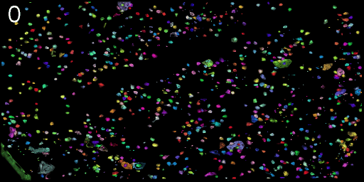
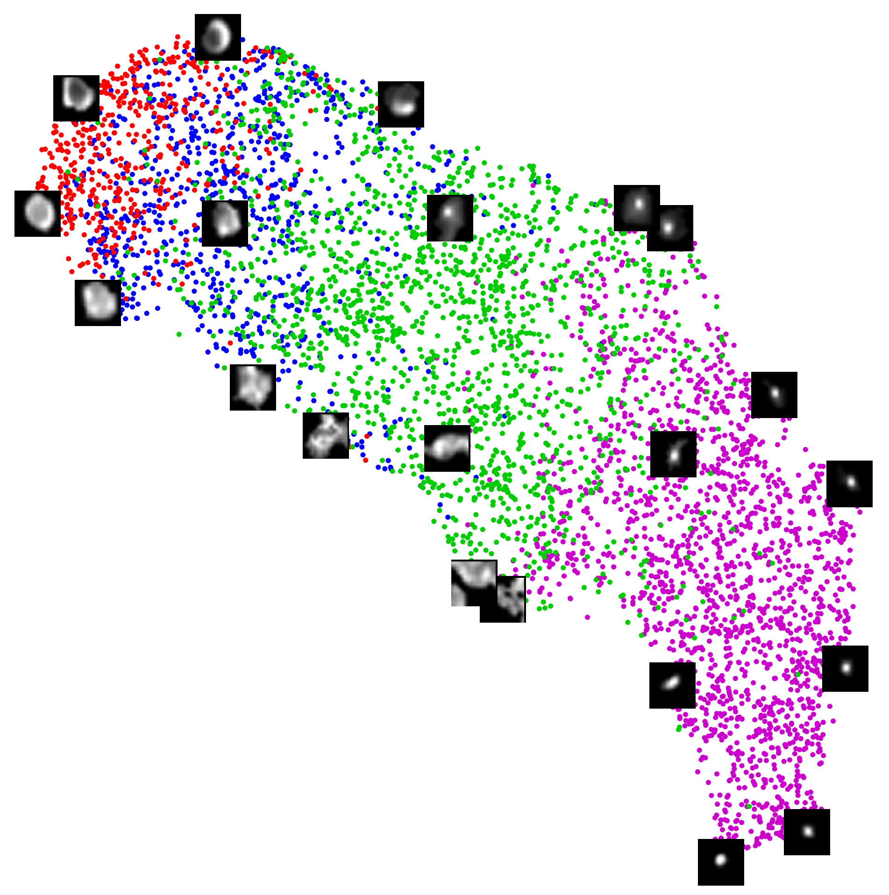

# Welcome to ROICaT

<div>
    
</div>

[](https://github.com/RichieHakim/ROICaT/actions/workflows/build.yml) 
[](https://badge.fury.io/py/roicat)
[](https://pepy.tech/project/roicat)

- **Documentation: [https://roicat.readthedocs.io/en/latest/](https://roicat.readthedocs.io/en/latest/)**
- Discussion forum: [https://groups.google.com/g/roicat_support](https://groups.google.com/g/roicat_support)
- Technical support: [Github Issues](https://github.com/RichieHakim/ROICaT/issues)

## **R**egion **O**f **I**nterest **C**lassification **a**nd **T**racking ᗢ
A simple-to-use Python package for automatically classifying images of cells and tracking them across imaging sessions/planes.
<div>
    
</div>

**Why use ROICaT?**
- ROICaT was made to be better than existing tools. It is capable of classifying
  and tracking neuron ROIs at accuracies approaching human performance. Several
  labs currently use ROICaT to do automatic tracking and classification of ROIs
  with no post-hoc curation required. 
- Great effort was taken to optimize performance. Computational requirements are
  minimal and run times are fast.
- It's easy to use. You don't need to know how to code. You can use the
  interactive notebooks to run the pipelines with just a few clicks.

With ROICaT, you can:
- **Classify ROIs** into different categories (e.g. neurons, dendrites, glia,
  etc.).
- **Track ROIs** across imaging sessions/planes (e.g. ROI #1 in session 1 is the
  same as ROI #7 in session 2).

**What data types can ROICaT process?** 
- ROICaT can accept any imaging data format including: Suite2p, CaImAn, CNMF,
  NWB, raw/custom ROI data and more. See below for details on how to use any
  data type with ROICaT.

**What are the minimum computing needs?** 
- We recommend the following as a starting point: 
    - 4 GB of RAM (more for large data sets e.g., ~32 GB for 100K neurons)
    - GPU not required but will increase run speeds ~5-50x


<br>
<br>

# How to use ROICaT
<div>
    
</div>

Listed below, we have a suite of easy to run notebooks for running the ROICaT
pipelines. 
- The Google CoLab notebooks can be run fully remotely without installing
  anything on your computer.
- The Jupyter notebooks can be run locally on your computer and require you to
  install ROICaT.

**TRACKING:** 
- [Interactive
  notebook](https://github.com/RichieHakim/ROICaT/blob/main/notebooks/jupyter/tracking/tracking_interactive_notebook.ipynb)
- [Google
  CoLab](https://githubtocolab.com/RichieHakim/ROICaT/blob/main/notebooks/colab/tracking/tracking_interactive_notebook.ipynb)
<!-- - (TODO) [script](https://github.com/RichieHakim/ROICaT/blob/main/notebooks/jupyter/tracking/tracking_scripted_notebook.ipynb) -->
  
**CLASSIFICATION:**
- [Interactive notebook -
  Drawing](https://github.com/RichieHakim/ROICaT/blob/main/notebooks/jupyter/classification/classify_by_drawingSelection.ipynb)
- [Google CoLab -
  Drawing](https://githubtocolab.com/RichieHakim/ROICaT/blob/main/notebooks/colab/classification/classify_by_drawingSelection_colab.ipynb)
- [Interactive notebook -
  Labeling](https://github.com/RichieHakim/ROICaT/blob/main/notebooks/jupyter/classification/labeling_interactive.ipynb)
- [Interactive notebook - Train
  classifier](https://github.com/RichieHakim/ROICaT/blob/main/notebooks/jupyter/classification/classifier_train_interactive.ipynb)
- [Interactive notebook - Inference with
  classifier](https://github.com/RichieHakim/ROICaT/blob/main/notebooks/jupyter/classification/classifier_inference_interactive.ipynb)

**OTHER:** 
- [Custom data importing
  notebook](https://github.com/RichieHakim/ROICaT/blob/main/notebooks/jupyter/other/demo_data_importing.ipynb)
- Use the API to integrate ROICaT functions into your own code:
  [Documentation](https://roicat.readthedocs.io/en/latest/roicat.html).
<!-- - Train a new ROInet model using the provided Jupyter Notebook [TODO: link]. -->

# General workflow:
- **Pass ROIs through ROInet:** Images of the ROIs are passed through a neural
  network which outputs a feature vector for each image describing what the ROI
  looks like.
-  **Classification:** The feature vectors can then be used to classify ROIs:
   - A simple regression-like classifier can be trained using user-supplied
     labeled data (e.g. an array of images of ROIs and a corresponding array of
     labels for each ROI).
   - Alternatively, classification can be done by projecting the feature vectors
     into a lower-dimensional space using UMAP and then simply circling the
     region of space to classify the ROIs.
-  **Tracking**: The feature vectors can be combined with information about the
   position of the ROIs to track the ROIs across imaging sessions/planes.


# Installation
ROICaT works on Windows, MacOS, and Linux. If you have any issues during the
installation process, please make a [github
issue](https://github.com/RichieHakim/ROICaT/issues) with the error.

### 0. Requirements
- Your segmented data. For example Suite2p output data (stat.npy and ops.npy
  files), CaImAn output data (results.h5 files), or any other type of data using
  this [custom data importing
  notebook](https://github.com/RichieHakim/ROICaT/blob/main/notebooks/jupyter/other/demo_data_importing.ipynb).
- [Anaconda](https://www.anaconda.com/distribution/) or
  [Miniconda](https://docs.conda.io/en/latest/miniconda.html).
- If using Windows: [Microsoft C++ Build
  Tools](https://visualstudio.microsoft.com/visual-cpp-build-tools/)
- If using linux/unix(MacOS): GCC >= 5.4.0, ideally == 9.2.0. Check with: `gcc
  --version`, or just google how to do this on your operating system. 
- **Optional:** [CUDA compatible NVIDIA
  GPU](https://developer.nvidia.com/cuda-gpus) and
  [drivers](https://developer.nvidia.com/cuda-toolkit-archive). Using a GPU can
  increase ROICaT speeds ~5-50x, though without it, ROICaT will still run
  reasonably quick. GPU support is not available for Macs.
- The below commands should be run in the terminal (Mac/Linux) or Anaconda
  Prompt (Windows).

### 1. (Recommended) Create a new conda environment
```
conda create -n roicat python=3.12
conda activate roicat
pip install --upgrade pip
```
You will need to activate the environment with `conda activate roicat` each time
you want to use ROICaT.

### 2. Install ROICaT
```
pip install --user roicat[all]
pip install git+https://github.com/RichieHakim/roiextractors
```
Note: if you are using a zsh terminal, change command to: `pip3 install --user
'roicat[all]'` For installing GPU support on Windows, see
[Troubleshooting](#troubleshooting-gpu-support) below.

### 3. Clone the repo to get the scripts and notebooks
```
git clone https://github.com/RichieHakim/ROICaT
```
Then, navigate to the `ROICaT/notebooks/jupyter` directory to run the notebooks.

# Troubleshooting Installation
### Troubleshooting (Windows)
If you receive the error: `ERROR: Could not build wheels for hdbscan, which is
required to install pyproject.toml-based projects` on Windows, make sure that
you have installed Microsoft C++ Build Tools. If not, download from
[here](https://visualstudio.microsoft.com/visual-cpp-build-tools/) and run the
commands:
```
cd path/to/vs_buildtools.exe
vs_buildtools.exe --norestart --passive --downloadThenInstall --includeRecommended --add Microsoft.VisualStudio.Workload.NativeDesktop --add Microsoft.VisualStudio.Workload.VCTools --add Microsoft.VisualStudio.Workload.MSBuildTools
```
Then, try proceeding with the installation by rerunning the pip install commands
above.
([reference](https://stackoverflow.com/questions/64261546/how-to-solve-error-microsoft-visual-c-14-0-or-greater-is-required-when-inst))

### Troubleshooting (GPU support)
GPU support is not required. Windows users will often need to manually install a
CUDA version of pytorch (see below). Note that you can check your nvidia driver
version using the shell command: `nvidia-smi` if you have drivers installed. 

Use the following command to check your PyTorch version and if it is GPU
enabled:
```
python -c "import torch, torchvision; print(f'Using versions: torch=={torch.__version__}, torchvision=={torchvision.__version__}');  print(f'torch.cuda.is_available() = {torch.cuda.is_available()}')"
```
**Outcome 1:** Output expected if GPU is enabled:
```
Using versions: torch==X.X.X+cuXXX, torchvision==X.X.X+cuXXX
torch.cuda.is_available() = True
```
This is the ideal outcome. You are using a <u>CUDA</u> version of PyTorch and
your GPU is enabled.

**Outcome 2:** Output expected if <u>non-CUDA</u> version of PyTorch is
installed:
```
Using versions: torch==X.X.X, torchvision==X.X.X
OR
Using versions: torch==X.X.X+cpu, torchvision==X.X.X+cpu
torch.cuda.is_available() = False
```
If a <u>non-CUDA</u> version of PyTorch is installed, please follow the
instructions here: https://pytorch.org/get-started/locally/ to install a CUDA
version. If you are using a GPU, make sure you have a [CUDA compatible NVIDIA
GPU](https://developer.nvidia.com/cuda-gpus) and
[drivers](https://developer.nvidia.com/cuda-toolkit-archive) that match the same
version as the PyTorch CUDA version you choose. All CUDA 11.x versions are
intercompatible, so if you have CUDA 11.8 drivers, you can install
`torch==2.0.1+cu117`.

### **Solution 2:**
If you are sure you have a compatible GPU and correct drivers, you can force
install the GPU version of pytorch, see the pytorch installation instructions.
Links for the [latest version](https://pytorch.org/get-started/locally/) or
[older versions](https://pytorch.org/get-started/previous-versions/). Example:
```
pip install torch==2.1.2 torchvision==0.16.2 torchaudio==2.1.2 --index-url https://download.pytorch.org/whl/cu118
```

**Outcome 3:** Output expected if CUDA version of PyTorch is installed but GPU
is not available:
```
Using versions: torch==X.X.X+cuXXX, torchvision==X.X.X+cuXXX
torch.cuda.is_available() = False
```
If a CUDA version of PyTorch is installed but GPU is not available, make sure
you have a [CUDA compatible NVIDIA GPU](https://developer.nvidia.com/cuda-gpus)
and [drivers](https://developer.nvidia.com/cuda-toolkit-archive) that match the
same version as the PyTorch CUDA version you choose. All CUDA 11.x versions are
intercompatible, so if you have CUDA 11.8 drivers, you can install
`torch==2.0.1+cu117`.


# TODO:
- Some more integration tests
- Switch to ONNX for ROINet
- Add more documentation / tutorials
- Make a GUI
- Finish ROIextractors integration
- Make a Docker container
- Make a standard classifier
- Write the paper
- Make tweet about it