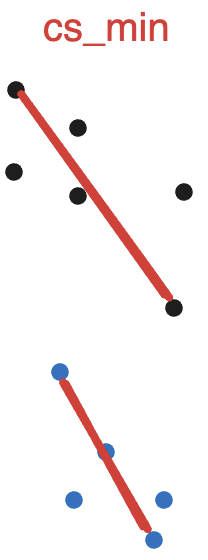
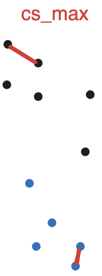
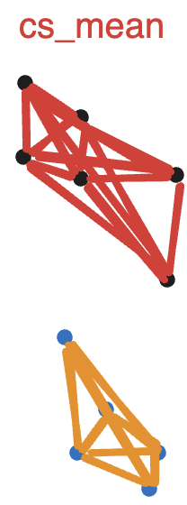
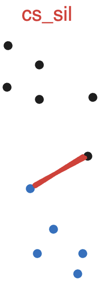
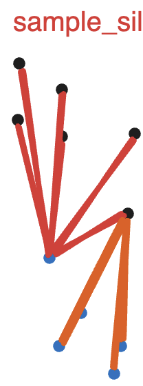

Inputs and Outputs
==================

Inputs
######

- **Suite2p output files:** ``stat.npy`` and ``ops.npy`` files only.
- **Other data formats:** Support for formats like CaImAn, custom ROIs, etc.,
  can be facilitated through a custom data importing notebook found `here
  <https://github.com/RichieHakim/ROICaT/blob/main/notebooks/jupyter/other/demo_data_importing.ipynb>`_.

-------

Outputs
#######

The outputs of ROICaT are encapsulated in a ``results.pkl`` file, which is a
Python dictionary containing the following fields:

Clusters
~~~~~~~~

- **labels:** Unique Cluster IDs (aka **'UCIDs'**) for each ROI. These are
  integer labels indicating which cluster each ROI belongs to. ``-1`` indicates
  an ROI that was not clustered. Array of shape: ``(n_ROIs_total,)``.
- **labels_bySession:** UCIDs for each ROI, by session. List of length
  ``n_sessions``, where each element is an array of shape ``(n_ROIs_session,)``.
- **labels_bool:** Sparse boolean matrix describing which ROIs are in which
  clusters. Rows are ROI indices, columns are UCIDs + 1.
- **labels_bool_bySession:** Same as ``labels_bool``, but by session.
- **labels_dict:** Dictionary mapping UCIDs to ROI indices. Keys are UCIDs,
  values are lists of ROI indices.

ROIs
~~~~

- **ROIs_aligned:** Images of all ROIs, aligned by session.
- **ROIs_raw:** Raw spatial footprints of the ROIs.
- **frame_height, frame_width:** Dimensions of the Field of View (FOV).
- **idx_roi_session:** Session-wise ROI indices.
- **n_sessions:** Number of sessions.

-------

Applying labels to Data
~~~~~~~~~~~~~~~~~~~~~~~

You can use the output labels to align any data with the same indexing as the
ROIs like time series (calcium traces). ROICaT provides a set of functions to
help with this. The term **"UCID" (Unique Cluster ID)** is used to
refer to the cluster labels. All functions are within the :ref:`roicat.util
<roicat-util-module>` module.

- ``roicat.util.match_arrays_with_ucids``: Align data using UCIDs. This function
  will align data arrays (e.g., calcium traces) using the UCIDs.
- ``roicat.util.mask_UCIDs_with_iscell``: Update UCIDs based on an ``iscell``
  array (provided by Suite2p or ROICaT classification). This function will set
  the UCID of any ROI with ``iscell==0`` to -1.
- ``roicat.util.discard_UCIDs_with_fewer_matches``: Discard UCIDs with fewer
  than a specified number of matches.

-------

Quality Control
~~~~~~~~~~~~~~~

Typically, little post-hoc curation is needed. However, defining inclusion
criteria is useful for quality control. Below is a section from `Nguyen et al.
(Nature 2023) <https://www.google.com>`_ that describes the inclusion criteria
used in their study:

.. admonition:: Nguyen et al. (2023)
   
   ROI masks and field-of-view images were supplied using Suite2p output files.
   ROICaT's default settings were used with the following parameters: automatic
   hyperparameter tuning was used to align fields of view and to calculate, mix and
   prune pairwise ROI similarity matrices. The parameter controlling the degree of
   pruning in the similarity graph was slightly increased to increase cluster sizes
   **('stringency'=1.3)**. For clustering of the final similarity matrix, ROICaT's
   recommended method was used: if an experiment contained eight or more recorded
   sessions, ROICaT uses its standard cluster fitting method based on
   robust-single-linkage-clustering with the default parameters **'min_clusters'=2**
   and **'alpha'=0.999**. For animals with seven or fewer recorded sessions, ROICaT's
   alternative cluster fitting method based on the sequential Hungarian method
   algorithm was used with **'thesh_cost'=0.6**. The resulting clusters were inspected
   for quality using ROICaT's output quality metrics and visualization tools, and
   an inclusion criterion was set using the 'cs_sil' metric **('cluster similarity
   silhouette score') of 0.2**.

For my own data, I often use the following inclusion criteria:

- **cluster_silhouette > 0.2**: Discard all clusters with scores below this
  threshold.
- **sample_silhouette > 0.1**: Discard all ROIs with scores below this
  threshold. You can set their label to -1 to signify that they are unclustered
  samples.

Quality Metrics
~~~~~~~~~~~~~~~

- **cs_min:** Intra-cluster minimum similarity. Defined as the lowest pairwise
  similarity within a cluster. *shape:* (n_clusters,).

|

- **cs_max:** Intra-cluster maximum similarity. Defined as the highest
  similarity within a cluster. *shape:* (n_clusters,).

|

- **cs_mean:** Mean intra-cluster similarity. Defined as the average similarity
  within a cluster. *shape:* (n_clusters,).

|

- **cs_sil:** Cluster silhouette score. A measure of how similar an ROI is to
  its own cluster compared to other clusters, which can be indicative of the
  appropriateness of the cluster assignment. Defined as ``(intra - inter) /
  np.maximum(intra, inter)`` where ``intra=cs_intra_mean`` and
  ``inter=cs_inter_maxOfMaxes``. *shape:* (n_clusters,).

|

- **sample_sil:** Sample silhouette score. See `sklearn.metrics.silhouette_score
  <https://scikit-learn.org/stable/modules/generated/sklearn.metrics.silhouette_score.html>`_
  documentation for more details. A measure of how well each ROI is clustered
  with its label, providing a perspective on the overall clustering quality.
  Defined using ``sklearn.metrics.silhouette_score``. *shape:* (n_ROIs_total,).

|

