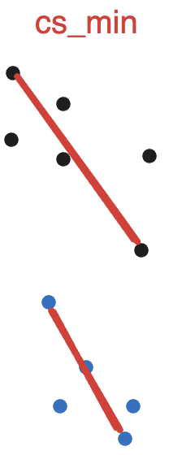
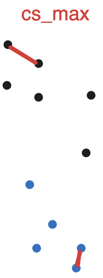
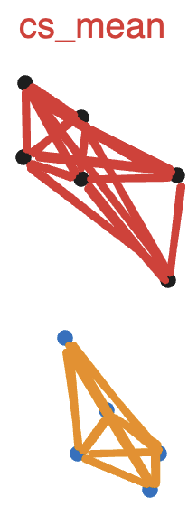
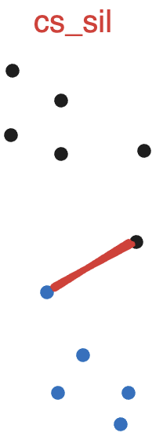
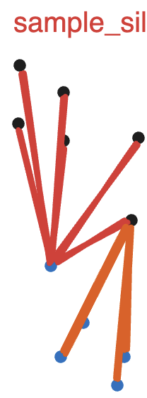

Inputs and Outputs
==================

Inputs
######

- **Suite2p output files:** ``stat.npy`` and ``ops.npy`` files only.
- **Other data formats:** Support for formats like CaImAn, custom ROIs, etc.,
  can be facilitated through a custom data importing notebook found `here
  <https://github.com/RichieHakim/ROICaT/blob/main/notebooks/other/demo_data_importing.ipynb>`_.

-------

Outputs
#######

The outputs of ROICaT tracking are encapsulated in a set of files. The main file
is a ``...tracking.results_all.richfile`` (directory or archive) that can be
loaded using ``roicat.util.RichFile_ROICaT``. Multiple storage backends are
supported: ``'directory'`` (default, produces a folder tree), ``'sqlar'``
(single SQLite archive), ``'zip'`` (single ZIP file), and ``'tar'`` (single TAR
file). The backend can be configured via
``params['results_saving']['richfile_backend']``. The result is a python
dictionary with the following fields:

Clusters
~~~~~~~~

- **labels:** Unique Cluster IDs (aka **'UCIDs'**) for each ROI. These are
  integer labels indicating which cluster each ROI belongs to. ``-1`` indicates
  an ROI that was not clustered. Array of shape: ``(n_ROIs_total,)``.
- **labels_bySession:** UCIDs for each ROI, by session. List of length
  ``n_sessions``, where each element is an array of shape ``(n_ROIs_session,)``.
- **labels_bool:** Sparse boolean matrix describing which ROIs are in which
  clusters. Rows are ROI indices, columns are UCIDs + 1.
- **labels_bool_bySession:** Same as ``labels_bool``, but by session.
- **labels_dict:** Dictionary mapping UCIDs to ROI indices. Keys are UCIDs,
  values are lists of ROI indices.
- **quality_metrics:** Dictionary of quality metrics for each cluster. See below
  section `Quality Metrics <quality-metrics>`_ for more details.

ROIs
~~~~

- **ROIs_aligned:** Images of all ROIs, aligned by session.
- **ROIs_raw:** Raw spatial footprints of the ROIs.
- **frame_height, frame_width:** Dimensions of the Field of View (FOV).
- **idx_roi_session:** Session-wise ROI indices.
- **n_sessions:** Number of sessions.

-------

Applying labels to Data
~~~~~~~~~~~~~~~~~~~~~~~

You can use the output labels to align any data with the same indexing as the
ROIs like time series (calcium traces). ROICaT provides a set of functions to
help with this. The term **"UCID" (Unique Cluster ID)** is used to
refer to the cluster labels. All functions are within the :ref:`roicat.util
<roicat-util-module>` module.

- ``roicat.util.match_arrays_with_ucids``: Align data using UCIDs. This function
  will align data arrays (e.g., calcium traces) using the UCIDs.
- ``roicat.util.mask_UCIDs_with_iscell``: Update UCIDs based on an ``iscell``
  array (provided by Suite2p or ROICaT classification). This function will set
  the UCID of any ROI with ``iscell==0`` to -1.
- ``roicat.util.discard_UCIDs_with_fewer_matches``: Discard UCIDs with fewer
  than a specified number of matches.

-------

Quality Control
~~~~~~~~~~~~~~~

Typically, little post-hoc curation is needed. However, defining inclusion
criteria is useful for quality control. Below is a section from `Nguyen et al.
(Nature 2023) <https://www.nature.com/articles/s41586-023-06810-1>`_ that describes the inclusion criteria
used in their study:

.. admonition:: Nguyen et al. (2023)
   
   ROI masks and field-of-view images were supplied using Suite2p output files.
   ROICaT's default settings were used with the following parameters: automatic
   hyperparameter tuning was used to align fields of view and to calculate, mix and
   prune pairwise ROI similarity matrices. The parameter controlling the degree of
   pruning in the similarity graph was slightly increased to increase cluster sizes
   **('stringency'=1.3)**. For clustering of the final similarity matrix, ROICaT's
   recommended method was used: if an experiment contained eight or more recorded
   sessions, ROICaT uses its standard cluster fitting method based on
   robust-single-linkage-clustering with the default parameters **'min_clusters'=2**
   and **'alpha'=0.999**. For animals with seven or fewer recorded sessions, ROICaT's
   alternative cluster fitting method based on the sequential Hungarian method
   algorithm was used with **'thesh_cost'=0.6**. The resulting clusters were inspected
   for quality using ROICaT's output quality metrics and visualization tools, and
   an inclusion criterion was set using the 'cs_sil' metric **('cluster similarity
   silhouette score') of 0.2**.

The ``cs_sil`` metric in this quote is now called ``cluster_silhouette``.

For my own data, I often use the following inclusion criteria:

- **cluster_silhouette > somewhere around -0.1**: Discard all clusters with
  scores below this threshold. Higher thresholds, up to about 0.2, remove more
  tracking errors but also discard many correctly tracked cells, so choose based
  on how much identity error your analysis can tolerate.
- **sample_silhouette > 0.1**: Discard all ROIs with scores below this
  threshold. You can set their label to -1 to mark them as unclustered. This
  removes single poorly matched ROIs and keeps the rest of their cluster.

**When precision matters most**, raise the ``sample_silhouette`` cutoff to
about 0.3 first. We tested these cutoffs on 55 animals with ground truth, across
8 datasets. On 6 of the 8 datasets, filtering ROIs by ``sample_silhouette`` gave
a better trade-off between removing errors and keeping correct matches than
raising the ``cluster_silhouette`` cutoff. On the 5 datasets with curated
ground truth, a ``sample_silhouette`` cutoff of 0.3 removed 16 to 50% of
tracking errors and cost 2 to 7% of correct matches, compared with no
filtering. When we chose the cutoff on some datasets and tested it on the
others, the chosen value landed between 0.18 and 0.34.

Lowering ``stringency`` does little for precision. Going from 1.0 to 0.5 raised
precision by at most 0.05 and lowered recall by up to 0.2.

No single cutoff of any metric gives the same precision on every dataset. Look
at some clusters from your own data before you settle on a cutoff. The quality
metrics figure described below shows how many ROIs each cutoff keeps.

Quality Metrics
~~~~~~~~~~~~~~~

The tracking results store these metrics in the ``quality_metrics``
dictionary. The ``cluster_*`` metrics have one value per entry of
``cluster_labels_unique``. That list includes -1 when some ROIs were not
clustered. The ``sample_*`` metrics have one value per ROI, across all sessions.

- **cluster_intra_mins:** Intra-cluster minimum similarity. Defined as the
  lowest pairwise similarity within a cluster. *shape:* (n_clusters,).

|

- **cluster_intra_maxs:** Intra-cluster maximum similarity. Defined as the
  highest similarity within a cluster. *shape:* (n_clusters,).

|

- **cluster_intra_means:** Mean intra-cluster similarity. Defined as the
  average similarity within a cluster. *shape:* (n_clusters,).

|

- **cluster_silhouette:** Cluster silhouette score. A measure of how similar
  the ROIs in a cluster are to each other compared to ROIs in other clusters,
  which can be indicative of the appropriateness of the cluster assignment.
  Defined as ``(intra - inter) / np.maximum(intra, inter)``, where ``intra`` is
  ``cluster_intra_means`` and ``inter`` is the highest similarity between an
  ROI in the cluster and an ROI in any other cluster. *shape:* (n_clusters,).

|

- **sample_silhouette:** Sample silhouette score. See
  `sklearn.metrics.silhouette_samples
  <https://scikit-learn.org/stable/modules/generated/sklearn.metrics.silhouette_samples.html>`_
  documentation for more details. A measure of how well each ROI fits its own
  cluster compared to the nearest other cluster. Computed like
  ``sklearn.metrics.silhouette_samples``, on the sparse distance graph. ROIs
  labeled -1 are scored as if they formed one cluster, so ignore their scores.
  *shape:* (n_ROIs_total,).

|

- **sample_probabilities:** HDBSCAN membership strength of each ROI, from 0
  to 1. ``None`` when the clustering used single-linkage or the Hungarian
  method. *shape:* (n_ROIs_total,).
- **hdbscan:** A dictionary of other HDBSCAN outputs, such as outlier scores.
  ``None`` when the clustering used single-linkage or the Hungarian method.

Quality Metrics Figure
~~~~~~~~~~~~~~~~~~~~~~

The tracking pipeline saves a figure of these metrics to
``visualization/clustering/quality_metrics.png`` in the save directory. You can
also draw it with ``roicat.tracking.clustering.plot_quality_metrics``. The top
row has one value per cluster. The bottom row is computed from each ROI.

- **Top left:** Histogram of ``cluster_silhouette``.
- **Top middle:** Histogram of ``cluster_intra_means``.
- **Top right:** Number of clusters that span each number of sessions.
- **Bottom left:** Histogram of ``sample_silhouette`` for clustered ROIs.
- **Bottom middle:** Fraction of clustered ROIs kept at each cutoff, for a
  ``sample_silhouette`` cutoff and for a ``cluster_silhouette`` cutoff. Use it
  to see how many ROIs a cutoff removes before you apply it.
- **Bottom right:** Fraction of each session's ROIs that were placed in a
  cluster. A session far below the others may be badly aligned.

The pipeline also saves these outputs:

- ``visualization/clustering/session_match_fraction.png``: For each pair of
  sessions, the fraction of one session's ROIs matched to an ROI of the other,
  also plotted against the session gap. Wrong matches count too, so it shows
  how often ROIs were linked, not whether the links are right.
- ``visualization/FOV_sample_silhouette.webp``: Each session's ROIs colored by
  ``sample_silhouette``, from yellow (low) to purple (high). Unclustered ROIs
  are grey.

